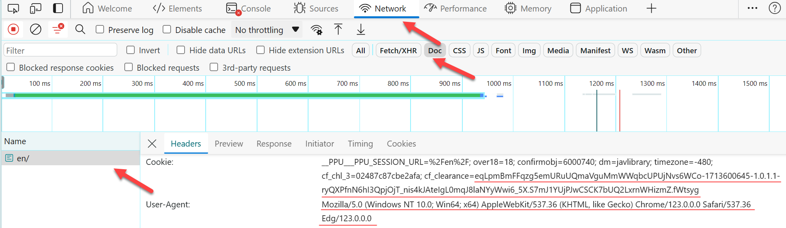
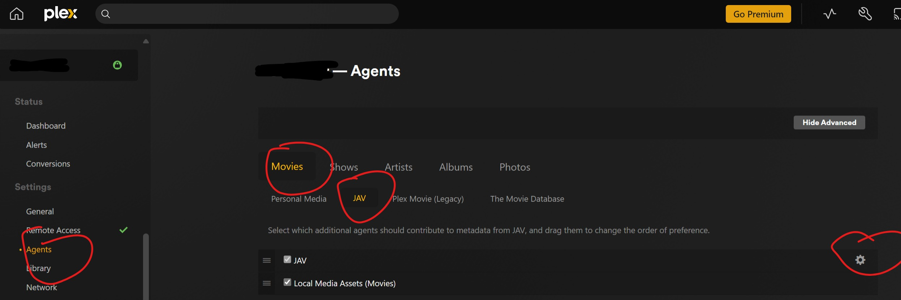
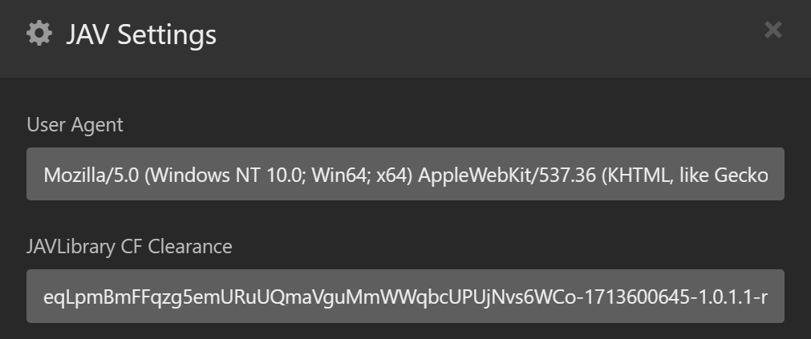

# JAV.bundle

[中文版Readme](README.zh.md)

**JAV.bundle** is a [plex](https://plex.tv) agent for Japanese porn videos. It collects data from [JavLibrary](https://javlibrary.com/), [AVEntertainments](https://www.aventertainments.com/) and some studio's official sites.

This agent currently only supports crawl Japanese contents, you can create a pull request to help us to support other languages.

- [Installation](#installation)
- [Usage](#usage)
  - [JAVLibrary](#javlibrary)
- [Guide](#guide)
  - [Name and organize your videos](#name-and-organize-your-videos)
  - [Manually identify your video](#manually-identify-your-video)
- [Contribute to this project](#contribute-to-this-project)
- [Changelog](#changelog)
  - [2024-04-20](#2024-04-20)
  - [2022-09-06](#2022-09-06)
- [Credits](#credits)
- [Donate](#donate)

## Installation
Download the latest source zip from [repository](https://github.com/Xavier-Lam/JAV.bundle), then unzip the zip file to the [Plex plugin folder](https://support.plex.tv/hc/en-us/articles/201106098-How-do-I-find-the-Plug-Ins-folder-). You can follow [this guide](https://support.plex.tv/articles/201187656-how-do-i-manually-install-a-plugin/) to install JAV.bundle.

## Usage
After the plugin has been installed, you can select `JAV` as your library's agent in your library's edit page, and you should use `Plex Movie Scanner` as the library's scanner.

For users live in mainland of PR China, please make sure you have abilities to access the sites which the agent crawls data from, these sites may be blocked in your country.

### JAVLibrary
Recently, [JAVLibrary](https://javlibrary.com) reenabled cloudflare challenge. To bypass it, you have to follow these steps:

1. Visit [JAVLibrary](https://javlibrary.com) on your server and pass the challenge.
2. After you can see content on JAVLibrary
   1. open developer tools of your browser by pressing `F12`,
   2. refresh the page
   3. choose `Network` tab and select `Doc`
   4. choose the first request, copy the `User-Agent` header in your request and `cf_clearance` cookie value to the configuration in your plex agent Settings.
  
      
      
      

I know it is a bit hard for a non-developer, but I couldn't find other easy solutions.

> Note:
> 1. **The source IP address you visit JAVLibrary should be identical to your plex server outbound IP address**, if you are using a proxy, the address would be the outbound IP address of your proxy;
> 2. The `cf_clearance` value may change frequently, especially when you are using a proxy, every time your IP changes, the `cf_clearance` changes;
> 3. Every time you update your browser, the `User-Agent` would change.

> Or simply, you can use this project: [CF-Clearance-Scraper](https://github.com/Xewdy444/CF-Clearance-Scraper/tree/main) to get `cf_clearance` cookie.

## Guide
### Name and organize your videos
For censored videos, the video's name or its parent folder's name must contain the video id, using space or square bracket to split the id from other parts of title like these:

* JBD-226
* [JBD-226]No Torture Remaining 4 Shinoda Yu
* JBD-226 No Torture Remaining 4 Shinoda Yu

For the uncensored videos being crawled from their official site(including [caribbeancom](https://caribbeancom.com), [1pondo](https://1pondo.tv), [heyzo](https://heyzo.com) and [tokyo-hot](https://tokyo-hot.com)), I recommend to name your video or parent folder by including both studio's name and the video's id:

* 1Pondo 052611_102 Nozomi Hazuki
* Caribbean 111914-739 Facial For Mature 8 Part 1 Ryu Enami
* Heyzo 0796 Hamar's World 20 -Secrets about Miyuki- - Miyuki Ojima

For other uncensored videos whose data is collected from [AVEntertainments](https://aventertainments.com), You should name your video like this:

* [RED-052] Red Hot Fetish Collection Vol.37 : Kiriya Anno
* [SKY-101] Sky Angel Vol.63 Sayaka Fukuhara

### Manually identify your video
Sometimes you may not get the correct match result for your video, you can try to type the id of your video in the title field to correct the match result.

## Contribute to this project
You can create an issue to report bugs. Please descript your problem, provide the movie id or search conditions that you meet the problem. And upload your log file which located in your *[Plex Media Server data directory](https://support.plex.tv/articles/202915258-where-is-the-plex-media-server-data-directory-located/)/Logs/PMS Plugin Logs/* folder and named with *com.plexapp.agents.jav.log*.

I am not going to develop new features or add other data sources. You can create a pull request to contribute to this project if you wish. 

As the development document of plex plugin has been removed, you can check out [this archive](https://web.archive.org/web/20150107154037/http://dev.plexapp.com/docs/index.html) to learn how to develop a plex plugin. Your code must comply with [RestrictedPython](https://github.com/zopefoundation/RestrictedPython).

## Changelog
### 2024-04-20
Since [JAVLibrary](https://javlibrary.com) reenabled cloudflare challenge and [cloudscrapper](https://github.com/VeNoMouS/cloudscraper/tree/master) has not support the new challenge, I used a workaround by manual filling the User-Agent and challenge cookie in configuration page to bypass the challenge.

### 2022-09-06
I refactored my code completely for a better maintenance and optimized the matching strategy. The naming pattern for video id had been changed, so if you add a new version to a video, this version will be regarded as a newly added video with the same name with the old one.

## Credits
* This project is influenced by [JAVLibrary.bundle](https://github.com/w-k-io/JAVLibrary.bundle), thanks to [w-k.io](https://github.com/w-k-io).
* The actresses' avatars are provided by [gfriends](https://github.com/xinxin8816/gfriends) project.

## Donate
* I am still looking for an [oppaitime](https://oppaiti.me) and a [m-team](https://kp.m-team.cc) invitation, I'll be very appreciated if someone give me one.
